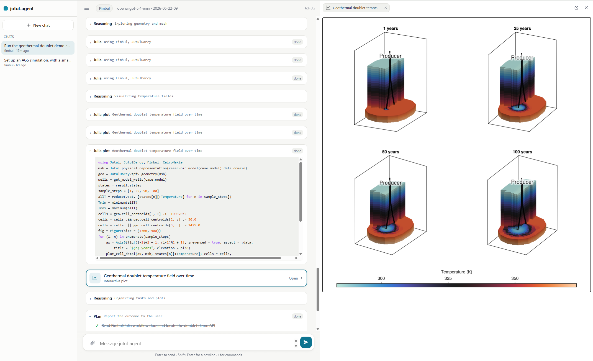
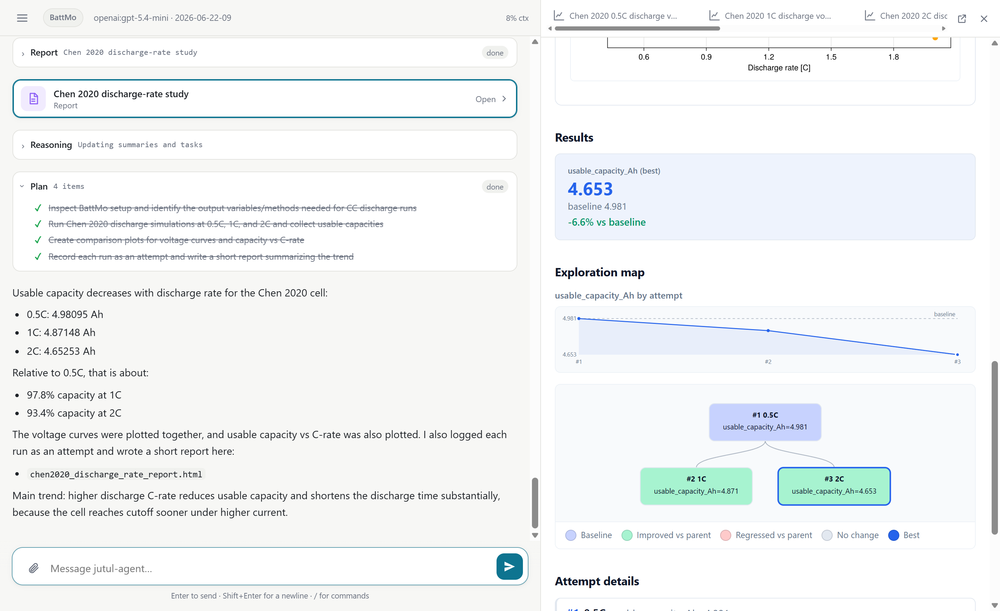

# jutul-agent

[](https://github.com/SINTEF-agentlab/jutul-agent/actions/workflows/ci.yml)
[](https://github.com/SINTEF-agentlab/jutul-agent/actions/workflows/simulators.yml)
[](https://sintef-agentlab.github.io/jutul-agent/)
[](https://pypi.org/project/jutul-agent/)
[](LICENSE)

A scientific AI agent for differentiable simulators built on the
[Jutul](https://github.com/sintefmath/Jutul.jl) framework. Ask for a
simulation in plain language. The agent sets it up, runs it, analyses and
plots the results, and iterates: fixing mistakes and refining the next run.

<p align="center">
  <a href="https://github.com/sintefmath/JutulDarcy.jl"></a>&nbsp;&nbsp;&nbsp;
  <a href="https://github.com/BattMoTeam/BattMo.jl"></a>&nbsp;&nbsp;&nbsp;
  <a href="https://github.com/sintefmath/Fimbul.jl"></a>&nbsp;&nbsp;&nbsp;
  <a href="https://github.com/sintefmath/Mocca.jl"></a>
</p>

<p align="center">
  
  &nbsp;&nbsp;&nbsp;
  
</p>
<p align="center"><sub>The browser UI (<code>jutul-agent web</code>): chat on the left; interactive plots and reports pinned in a canvas on the right. On the left, a Fimbul geothermal doublet showing the 3D temperature field around the wells over time. On the right, a BattMo C-rate study with voltage curves, an attempts map, and a written report.</sub></p>

## Quickstart

Install [uv](https://docs.astral.sh/uv/getting-started/installation/) and Julia
(via [juliaup](https://github.com/JuliaLang/juliaup)). Then:

```sh
uv tool install jutul-agent
jutul-agent key openai            # save a provider key (Anthropic and Google work too)

mkdir my-study && cd my-study
jutul-agent init --sim battmo     # jutuldarcy | battmo | fimbul | mocca
jutul-agent web                   # browser UI, or: tui, or run "<prompt>"
```

Local models through [Ollama](https://ollama.com) need no key. `init`
precompiles the Julia and plotting stacks once (a few minutes), so sessions
then start in seconds, and `jutul-agent doctor` checks the setup if anything
looks wrong. Keep it current with `jutul-agent upgrade`.

One folder is bound to one simulator and its Julia environment, so use a
separate folder for each. The browser UI opens at <http://127.0.0.1:8742> and
runs locally for a single trusted user. The full [installation and usage
guide](https://sintef-agentlab.github.io/jutul-agent/usage/) covers workspaces,
interfaces, and models; to work on jutul-agent itself, clone the repo (see
[Development](#development)).

## Supported simulators

| `--sim` | Package | Domain |
|---|---|---|
| `jutuldarcy` | [JutulDarcy.jl](https://github.com/sintefmath/JutulDarcy.jl) | Reservoir / multi-phase flow |
| `battmo` | [BattMo.jl](https://github.com/BattMoTeam/BattMo.jl) | Lithium-ion (and other) battery cells |
| `fimbul` | [Fimbul.jl](https://github.com/sintefmath/Fimbul.jl) | Geothermal (ATES, BTES, doublet, EGS) |
| `mocca` | [Mocca.jl](https://github.com/sintefmath/Mocca.jl) | Adsorption-based CO₂ capture (PSA / VSA / TSA) |

## What makes it work for scientific computing

- A persistent Julia REPL per session. State, loaded packages, and compiled
  methods carry across turns, and a first solve is fast because each
  simulator ships a precompiled warm package.
- The agent reads real source. Every package in the environment is on disk at
  its real `pkgdir` path (read-only in the shared depot), so answers come from
  the installed version, not from memory.
- Everything is recorded. Each session writes a trace of every message, tool
  call, and artifact. Transcripts and the benchmark grade against it.
- Models are interchangeable: OpenAI, Anthropic, Google, or local models via
  Ollama, switchable mid-session.

## Documentation

The full documentation lives at
[sintef-agentlab.github.io/jutul-agent](https://sintef-agentlab.github.io/jutul-agent/)
(source in [docs/](docs/)): using the agent, how it works (architecture,
the Julia kernel, the trace), and extending it (adding a simulator,
improving the agent, evaluation).

## Development

Work from a clone instead of a tool install. `uv run` resolves the
`jutul-agent` command from the checkout, so run every command through it
(`uv run jutul-agent ...`); upgrade with `git pull && uv sync`.

```sh
git clone https://github.com/SINTEF-agentlab/jutul-agent
cd jutul-agent
uv sync --extra eval
uv run pre-commit install

uv run ruff check .              # lint
uv run pytest                    # unit tests (integration and live skipped)
uv run pytest -m integration     # adds the Julia-requiring tests
uv run jutul-agent eval canary   # bench canary
```

Developed at [SINTEF](https://www.sintef.no/en/).
