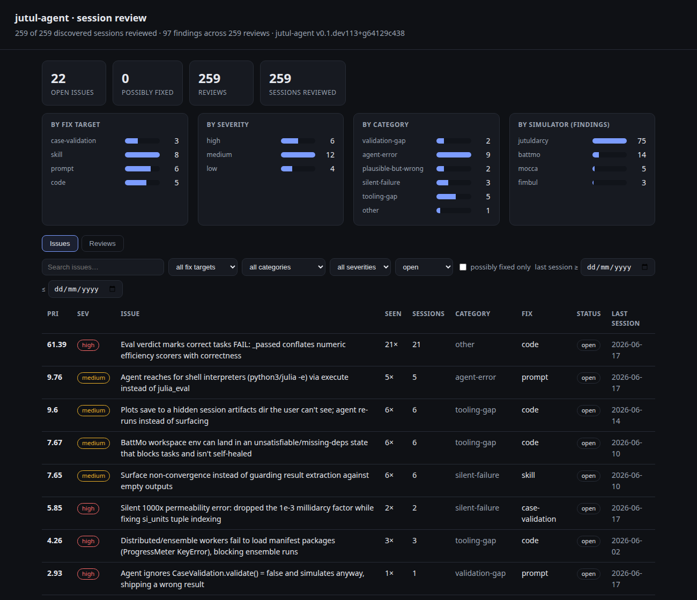

# Session review (self-improvement)

Session review is a developer tool: an autonomous critic that reads a finished
session and flags what the agent (or its in-Julia validation) missed, so gaps become
concrete improvements instead of things you spot by hand. It is off by default and
never shown to end users.

The failure it targets is the silent one: the run completes, nothing throws, the
answer looks plausible, but an input was nonsense (a unit left unconverted, an
out-of-range value) or a result is physically impossible. Those do not surface as
errors, so a second pair of eyes, here a capable model, is what catches them.

## Enabling it

| Variable | Meaning |
|---|---|
| `JUTUL_AGENT_REVIEW` | Set to `1` to review each session automatically when it ends. |
| `JUTUL_AGENT_REVIEW_MODEL` | Reviewer model (default `openai:gpt-5.4`). Judging plausibility is harder than the agent's own work, so this is usually a more capable model than the one driving the session. Use a `mini` model for quick local iteration. |

```bash
JUTUL_AGENT_REVIEW=1 jutul-agent "set up and run a case"
```

The whole session is reviewed once, when it ends (you quit the TUI, or the `--prompt`
turn finishes): one review per session, not per turn.

A review sends the rendered session (a busy one is about 25k tokens) and gets back a
small JSON report, plus a small curation call. With `openai:gpt-5.4` that is roughly
$0.06 to $0.10 per session; a `mini` model is about 10x less. It runs only when you
opt in. To spend nothing on the model, use the coding-agent path below.

## Two layers: the log and the issues

- Findings log (`<state home>/review/findings.jsonl`): the raw, append-only record,
  one entry per review, duplicates and all. The audit trail.
- Curated issues (`<state home>/review/issues.json`): the high-signal view. Each new
  review's findings are folded into a set of distinct issues by matching on root
  cause, not wording, incrementing a count and tracking which sessions and version
  they appeared in. So "permeability left in millidarcy" and "permeability not in SI"
  across two sessions become one issue seen 2x, not two log lines.

Instead of scrolling a flat log you see the recurring failures ranked, with how often
and where they happen.

## The CLI

```bash
jutul-agent review                  # curated issues, highest priority first (default)
jutul-agent review log              # the raw per-review findings log
jutul-agent review pending          # sessions on this machine not yet reviewed
jutul-agent review mine [--limit N] # review pending sessions in bulk (API)
jutul-agent review dashboard        # open the interactive dashboard (serves locally)
jutul-agent review export           # write a shareable file (see Sharing)
jutul-agent review curate           # fold the log into issues (re-run after changes)
jutul-agent review resolve <id>     # mark an issue fixed (a later recurrence re-opens it)
jutul-agent review dismiss <id>     # hide a not-worth-fixing issue
jutul-agent review delete <id>      # drop an issue from the store entirely
jutul-agent review prune --stale    # resolve every issue badged "possibly fixed"
jutul-agent review fix <id>         # print a fix-this-issue brief for a coding agent
jutul-agent review --json           # the curated store as JSON (for tooling)
jutul-agent review <session-id>     # review a past session now, log and curate it
```

Issues are ranked by a priority score (severity times recurrence, decayed by age), so
a fresh recurring problem sits above a stale one-off.

## Mining every session on the machine

Sessions are stored per workspace, but mining is cross-cutting. `review pending` and
`review mine` walk all workspaces under the state home, newest first, and skip
whatever already has a logged review (`--all` includes reviewed ones):

```bash
jutul-agent review pending --json --limit 20   # the unreviewed queue, as JSON
jutul-agent review mine --limit 10             # review the 10 most recent, via the API
```

`review <id>`, `review prompt <id>`, and `review ingest <id>` resolve a session id (or
unique prefix) from any workspace, so the coding-agent loop below works on the whole
backlog too.

### Eval runs

Eval runs are worth reviewing: the expected answer is known, so a plausible-but-wrong
result is easy to spot. The eval harness persists each sample's session under
`workspaces/eval-<sim>/`, so they appear in `review pending` and `mine` like any other
session. A task's expected answer is recorded in the trace, and after scoring the
run's pass/fail verdict is linked back onto the session. A review is then given both,
so it judges the result against ground truth, and the dashboard badges each eval
review PASS or FAIL. Review does not run during `jutul-agent eval`, so the eval itself
costs nothing extra; you mine the runs afterwards.

## The dashboard

```bash
jutul-agent review dashboard            # opens http://127.0.0.1:8765
jutul-agent review dashboard --port N --no-open
```



The dashboard is a local server (stdlib only, bound to 127.0.0.1). It shows coverage,
breakdowns by fix target, severity, category, and simulator, and the issues ranked by
priority and filterable, including a "possibly fixed only" filter. One click opens the
exact session transcript behind any issue or finding.

Each issue carries the date range of the sessions it was seen in (the actual session
dates, not when the review ran), so an issue last seen weeks ago ranks below one seen
today. Sort by the "Last session" column, or use the `last session ≥ / ≤` date filters
to narrow to a window — useful for telling apart issues that still reflect current
behaviour from stale ones a refactor has likely already fixed.

Each issue has actions: resolve, dismiss, delete, and generate a fix prompt. Clicking
an action changes the store and refreshes, so the dashboard is read and act in one
place. Issues last seen on an older version are badged "possibly fixed"; clear them in
bulk with `review prune --stale`.

## Acting on an issue

`review fix <id>` prints a self-contained brief: the problem, the evidence gathered
across every session it appeared in, where the fix most likely belongs (from its fix
target), and transcript pointers, ready to paste into a coding agent. The
`/review-fix <id>` command runs this in Claude Code and resolves the issue when done.

## Sharing

```bash
jutul-agent review export                 # one self-contained HTML file (transcripts embedded)
jutul-agent review export --format md     # a ranked Markdown digest of the open issues
jutul-agent review export -o report.html  # choose the path
```

`export` writes an offline, private artifact. The HTML form is a single file with
every reviewed transcript embedded, so one attachment carries the whole picture; the
Markdown form is a short digest for pasting into a doc or message.

## Reviewing with a coding agent (no API cost)

The expensive part is reading the session. You can hand that to a coding agent you
already pay for (Claude Code and the like) instead of the API:

```bash
jutul-agent review prompt <session-id> > req.md            # critic prompt + transcript
jutul-agent review ingest <session-id> --from findings.json   # log + curate it
```

`ingest` logs the findings (tagged `coding-agent`) and curates them like any other
review. Add `--no-curate` to only log, with no model call at all.

Curation is normally an LLM call that clusters same-root-cause findings, but when no
provider key is set it falls back to deterministic exact-title matching, so the
offline path stays API-free end to end. A later `review curate` with a key re-clusters
any reworded duplicates the title match missed.

### One command in Claude Code

The repo ships a `/review-mine` project command. Run it in Claude Code and it does the
whole loop: list pending sessions, read each transcript via `review prompt`, review it
against the rubric, reuse existing issue titles to curate, and `ingest` the result, at
no API cost. Pass an optional limit, e.g. `/review-mine 10`.

## What a finding looks like

Each review returns a short summary plus zero or more findings. A finding has a
category, a severity, evidence quoted from the session, a concrete suggestion, an
optional free-form detail, and a fix target that says where the fix belongs:

- `case-validation`: extend the active simulator's input/case validation to catch the input next time.
- `skill`: clarify or extend a skill so the agent avoids the mistake.
- `prompt`: adjust the system prompt.
- `eval`: add the session as a regression case to the eval suite.
- `code`: a jutul-agent change.

The category and fix-target labels are a guide, not a fixed checklist; the reviewer
uses "other" and explains in the detail field when a finding does not fit. The fix
targets are the loop: a `case-validation` finding is a candidate validation rule, an
`eval` finding is a candidate regression test. You review the log, accept what is real,
and route each to its target. Autonomous flagging, human-gated promotion.

Findings and issues are stored as JSON because curation has to merge, count, and rank
them. Each report also carries a prose summary, and the CLI renders everything as
readable text.

The reviewer is general: it reasons from the actual session, not a hard-coded
checklist, so it works across simulators and surfaces more than unit errors (agent
mistakes, unverified claims, missing checks). It is best-effort, so a missing key or a
model error simply skips the review without disturbing the run.
