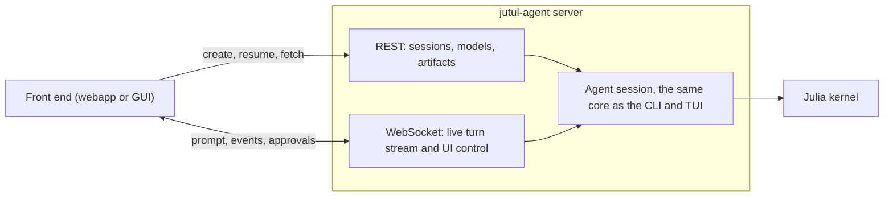
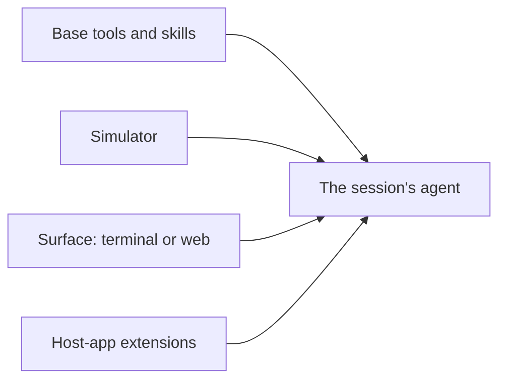

# The server interface

jutul-agent runs the same agent behind a command line and a terminal UI. The
server interface adds a third way to reach it: a network service that lets a
webapp, or any other graphical application, drive a session over HTTP and
WebSocket. It is how a non-expert works with the agent through a graphical app,
and how an existing application such as a simulator viewer or a dashboard gains a
conversational, tool-using assistant.

The server does not contain a second copy of the agent. It reuses the same
session core that the command line and the terminal UI run on (see
[architecture](architecture.md)), so the agent behaves the same way whichever
front end is attached. A front end only has to speak the HTTP and WebSocket
contract described here, so it can be written in any language with any framework.



## The web UI

`jutul-agent web` starts the server with a built-in web app: a chat interface
that is a visual alternative to the terminal UI. The web stack ships in the core
install, so nothing extra is needed. Point it at a simulator and open the browser:

```
jutul-agent web --sim jutuldarcy
```

Open <http://127.0.0.1:8742>. Type a task and watch the agent stream its reply,
run tools, and return plots, with the same session core behind it as every other
front end.


The server is bound to **one folder and one simulator**, the same way the
command line is: the folder is its launch directory (or `--workspace`), and the
simulator comes from `--sim`, the folder's saved `[workspace] simulator`, or
auto-detection, and is then remembered for next time. Every session in that
folder shares one simulator and one Julia environment; the UI does not switch
simulators in place. To work with a different simulator, run `jutul-agent web`
from a different folder. (A future central launcher that opens sessions across folders is a
deliberate later step; the create/resume API already accepts a folder and a
simulator per request, so it can grow into that without a protocol change.)

The bundled UI is a React and TypeScript application built with Vite. It ships
prebuilt inside the Python package, so the server serves it directly and users
never need Node. It is the default interface and the surface most extensions build
on: see [the web UI](web-ui.md) for how it is built and how to add a canvas panel.
The protocol below stays the stable contract, so an application that needs its own
front-end stack can still code against it directly.

## Running a session

A front end starts by creating a session over REST. Creating a session chooses
the model and the approval policy (see [approval and safety](approval.md)), uses
the server's bound simulator, and returns a session id. The create request can
also carry declarative tool specs, so an application in any language gives the
agent its own operations without a Python plug-in (see
[building your application](extending-for-your-application.md)). An earlier
session can be reopened by id, because conversation state is kept per session;
`/sessions/{id}/messages` then replays the whole conversation (text, reasoning,
tool cards and their results, and views) so a reopened chat is reconstructed
inline as it was left. If the session is still live on the server (its kernel is
up), resume reattaches to it with the Julia REPL state intact; if it has since
been reclaimed, resume restarts the kernel from disk (the conversation and files
return, in-memory REPL state does not). The response's `kernel_restarted` flag
says which happened. Each session is named from its first prompt and, once the
first turn finishes, upgraded to a short content-aware title (best-effort; the
first-prompt name stands if a model call is unavailable). The bundled UI lists
these in a collapsible left sidebar for one-click resume.

Once a session exists, the front end opens a WebSocket to it. That socket carries
the live, two-way exchange of a turn. The front end sends the user's prompt, and
the server streams the reply back as it is produced: assistant text, reasoning,
and each tool call as it starts and finishes. When the agent needs approval to
run a tool that has side effects, the server sends an approval request and waits
for the front end to send a decision. The front end can also cancel a running
turn.

| Method | Path | Purpose |
| --- | --- | --- |
| `POST` | `/sessions` | Create a session and return its id |
| `GET` | `/sessions` | List live session ids |
| `GET` | `/sessions/history` | List resumable sessions on disk (title, time, simulator) |
| `POST` | `/sessions/{id}/resume` | Reopen an earlier session (reattaches if still live, else restarts its kernel; `kernel_restarted` says which) |
| `DELETE` | `/sessions/{id}` | Close a session |
| `GET` | `/sessions/{id}/messages` | The full conversation (text, reasoning, tool calls and results, views), for replaying a resumed session inline |
| `GET` | `/sessions/{id}/artifacts/{path}` | Fetch a file the session produced |
| `GET` | `/sessions/{id}/transcript` | The transcript (`?format=html` or `md`) |
| `GET` | `/sessions/{id}/memory` | The session's workspace memory, as a page |
| `POST` | `/sessions/{id}/upload` | Add a file to the session workspace (`uploads/<name>`) |
| `GET` | `/models` | List the models that can be selected |
| `GET` | `/simulators` | List installed simulators (the server is bound to one, returned as `default`), each with its display name and starter prompts |

## The wire protocol

The WebSocket carries a small set of JSON messages. This is the contract a front
end is written against. It is a direct serialization of the events the agent
already produces, so the live stream never drifts from what the agent does.

Messages from the server to the front end:

| Message | Carries |
| --- | --- |
| `text` | A piece of the assistant's reply |
| `reasoning` | A piece of the assistant's reasoning |
| `tool` | A step in a tool call: requested, started, finished, or failed |
| `interrupt` | A request for approval, with the actions and the decisions allowed |
| `artifact` | A file the session produced, given as a URL |
| `viz` | An interactive view to pin in the side panel: a plot or a report, given as a URL |
| `usage` | The token usage for the turn |
| `turn_end` | The turn has finished |
| `ui` | A command for the front end to apply to its interface |
| `notice` | A system note from a command's result (e.g. `/compact`, `/add-dir`) |
| `error` | Something went wrong (a bad command, a failed turn, an unknown session) |

Messages from the front end to the server are a prompt to start a turn, a
decision to answer an approval request (`approve`, `reject`, or `respond` with a
message), a cancel to stop a running turn, a command to change a session setting
or run a session action (`set_model`, `set_approval`, `add_dir`, `compact`), and a
user-interface event, described next. A setting command rebuilds the agent in
place, so the model or approval policy can change mid-session without losing the
conversation or the live Julia state.

The bundled UI exposes these as slash commands in the composer (`/model`,
`/approval-mode`, `/add-dir`, `/compact`, plus client-side `/transcript`,
`/memory`, `/help`, `/clear`, `/copy`, `/context`), and renders each tool call in
a form that fits it: a plan as a checklist, a file edit as a diff, and so on.
None of that is part of the contract; it is how one front end chooses to present
the same stream.

### Driving the user interface

A graphical application is more than a transcript. The agent often needs to act
on the interface itself: set a parameter, toggle a control, highlight part of a
diagram, or move a map. The user acts on the same interface, and the agent should
be able to take that into account.

This two-way link is the `ui` message and the user-interface event. A tool can
emit a `ui` message, which names an action and carries a payload, and the front
end applies it. When the user changes something in the interface, the front end
sends an event back, which the agent sees on its next turn. The server fixes only
the shape of these messages. Which actions exist, and what they mean, belong to
the application, because they describe that application's own interface.

## Capabilities

How a simulator is used depends on the front end, not only on the simulator. In a
webapp the agent might operate a battery model's configuration controls, drive a
diagram of a model it has built, or load map and dataset layers. None of that
applies in a terminal. The unit that needs customizing is the pair of a simulator
and a front end, together with whatever an application brings of its own.

The agent for a session is composed from layers. Each layer can contribute tools,
skills, subagents, and additions to the system prompt.



The base layer provides the tools and skills every session has. The simulator
layer adds what is specific to the active simulator. The surface layer adds what
is specific to the front end, such as the controls a webapp exposes. Host-app
extensions add what a particular application needs. A `Capability` is the unit
that carries each layer's tools, skills, subagents, and prompt text, optionally
scoped to a surface.

This is where an application adds the behavior a given simulator and front end
need, without touching the core or the simulator registry. How to package and
register one (a Python entry point, or operations described over HTTP when the
backend is in another language) is covered in
[building your application](extending-for-your-application.md).

## Visualization

The terminal shows plots as images. A webapp can do better. A figure is rendered
with WebGL (WGLMakie) and served live from a small Bonito server that runs inside
the session's Julia process, which the front end embeds in a frame. The user can
rotate, zoom, and pan it in the browser, and because the figure stays live in the
session its in-figure widgets (a timestep slider, a field selector) run their
Julia callbacks and update the view. A self-contained static HTML export is also
written as the durable record and the fallback when the live server cannot start.

The server announces such a view with a `viz` message. Besides its URL it carries
a `kind` (`plot` or `report`), a stable `slot`, and an optional `poster` image
URL. The bundled UI uses these to keep a persistent **side canvas**: each view is
pinned there with a tab, the conversation keeps a compact chip that re-opens it,
and reusing a `slot` refreshes a view in place rather than stacking a new one. The
canvas is a true split, not an overlay (the conversation reflows beside it), and
the user can close it (the chips and a "Views" control reopen it). A front end is
free to present `viz` views differently; the protocol only fixes the message.

A written report is delivered the same way. `write_report` renders a
self-contained HTML document into the session's artifacts and the server forwards
it as a `viz` of kind `report`, so it lands in the same canvas next to the plots
instead of opening a desktop window.

This covers both figures the agent builds with Makie and a simulator's own native
interactive plotters. The native 3D viewers (for example JutulDarcy's
`plot_reservoir`, with its mesh, well trajectories, and field/timestep widgets)
build standard Makie scenes; their plotting methods ship in a GLMakie extension,
so the web session loads GLMakie for those methods while WGLMakie does the actual
browser rendering. Loading GLMakie needs a GL context, which the server provides
with an Xvfb on a headless box and which is already present on a workstation with
a display. A native plotter is asked to return its figure rather than open a
desktop window (`new_window = false`). Camera control (rotate, zoom, pan) runs in
the browser, and the in-figure widgets (a timestep slider, a field selector) drive
Julia callbacks over the live server's WebSocket; on the static fallback the camera
still works but those widgets are inert.

The image form is kept as well. It is the record written to the session's history
and report, the fallback when an interactive view is not available, and what
headless and evaluation runs use. An application that owns its own visualization,
such as a map, instead receives the underlying results through the extension
mechanism and draws them in its own stack.

## Running it, and hosting it later

The service runs locally first: one trusted user, or one trusted deployment,
alongside the application. That is enough for local use and for demonstrations. In
that setting the agent's access to the workspace, the shell, and Julia is
appropriate, because the user is trusted.

Serving it to several external users is a later and deliberate step, and the
design keeps room for it. A session can be scoped to its own workspace directory,
the service can require authentication, and a session can be run in its own
isolated process. Until that isolation is in place the service should not be
exposed to untrusted users, because the agent has real access to the machine it
runs on.

## The example app

The repository includes a small, runnable example under `examples/` that
exercises the whole interface and serves as a starting point to copy. It runs on a
tiny test library rather than a full simulator, so it stays fast and keeps the
focus on the wiring. Its simulator and its web capability are added through the
extension mechanism rather than the built-in registry, which also shows how to
bring a new simulator and front end of your own. The example covers creating a
session, streaming a reply, a tool call, an embedded interactive plot next to the
saved image, the user-interface round trip, and an approval round trip. Its
`README.md` has the command to run it and notes on extending it.
